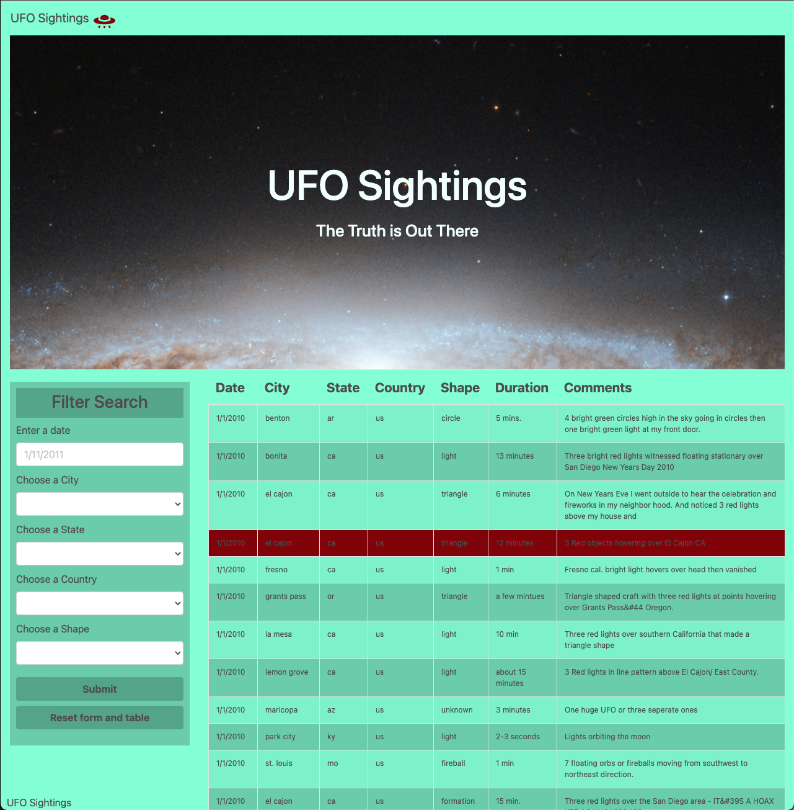

# javascript-challenge
14 JavaScript Homework - JavaScript and DOM manipulation  
  
Please note I chose not to reset the values of the fields on pressing the submit button so you can filter the search further and reset when you're ready.

* Project using a given dataset with UFO sightings in 2010.
* Created a website showing the information in a table format.
* Provided a filter search with multiple filter options using D3 and jQuery.

